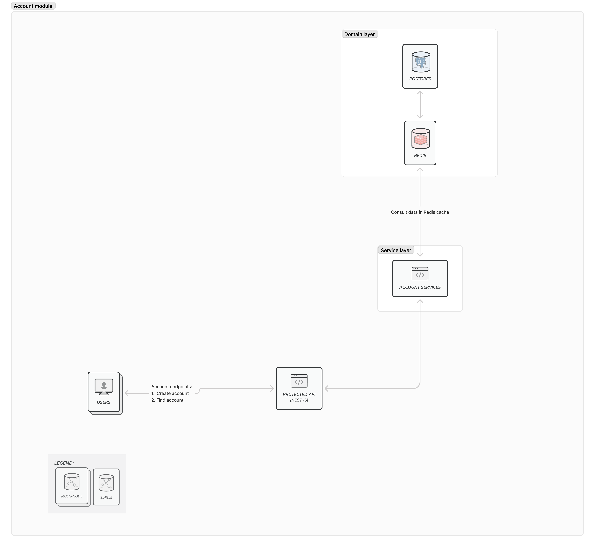
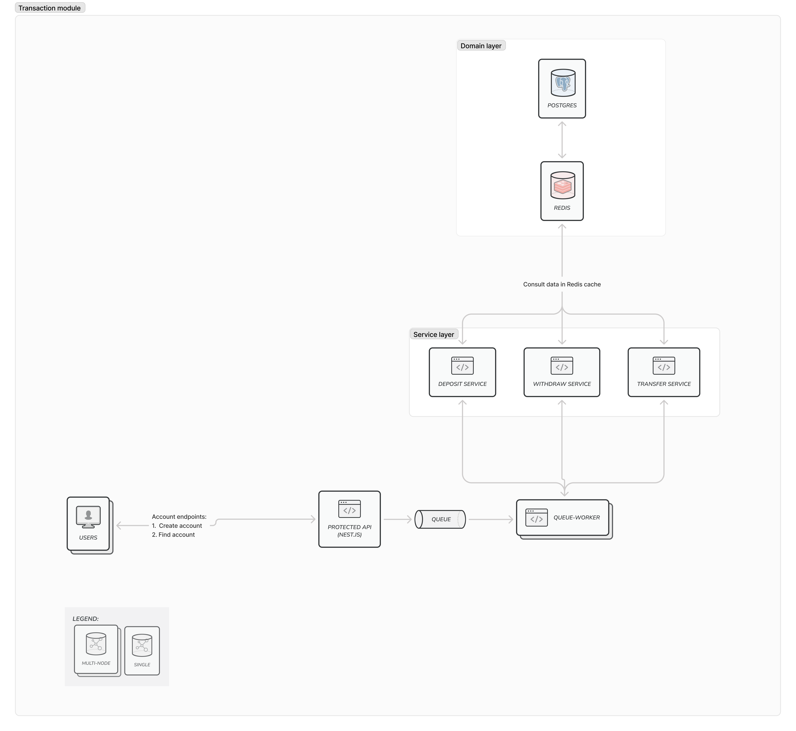

# Arquitetura

  Este documento descreve a arquitetura de alto nível do sistema de transações bancárias.

### Visão geral

  Este sistema foi desenvolvido para gerenciar operações bancárias, como depósitos, saques e transferências. Ele utiliza uma arquitetura modular com camadas de serviços e domínio bem definidas. O sistema processa as operações de forma assíncrona, o que melhora a eficiência e a resiliência.

  Cada módulo da aplicação será detalhado nas seções a seguir, destacando sua função e como ele se integra ao restante do sistema.

## Account

  - Responsável por gerenciar contas de usuário.

  A arquitetura do módulo `Account` é descrita no diagrama:

  

## Transaction

  Contém operações de transação financeira, incluindo:

  - **Depósito**: `deposit.service.ts`
  - **Saque**: `withdraw.service.ts`
  - **Transferência**: `transfer.service.ts`

  Cada operação é tratada de forma independente para manter a coesão e facilitar a manutenção.

  A arquitetura do módulo `Transaction` é descrita no diagrama:

  

  ### Fluxo de Transação

  O fluxo de processamento de transações começa quando o usuário inicia uma solicitação de transação (depósito, saque ou transferência) através de uma requisição HTTP para a API. A API então redireciona a solicitação para o serviço específico na Camada de Serviço (`TransactionService`). Quando o serviço recebe a solicitação, ele aciona o processador e coloca a transação na fila correspondente gerenciada pelo Bull para processamento assíncrono. Um Bull Worker retira a tarefa da fila e executa a operação necessária. Após isso, os dados da transação são persistidos no PostgreSQL, enquanto o Redis é atualizado para refletir o saldo atual e outras informações relevantes da conta.

## Tecnologias usadas
  - `Node.js`: Plataforma de desenvolvimento backend, escolhida pela sua performance e facilidade de construção de APIs REST.
  - `Nest.js`: Framework usado para organização modular e implementação da arquitetura em camadas.
  - `PostgreSQL`: Banco de dados relacional utilizado para armazenar dados persistentes, como contas e transações.
  - `Prisma`: ORM que simplifica a comunicação com o banco de dados, fornecendo uma camada de abstração para queries.
  - `Bull`: Biblioteca de gerenciamento de filas para processamento assíncrono, utilizada para lidar com transações financeiras.
  - `Redis`: Armazenamento em cache usado para melhorar a performance em operações de leitura frequente, como verificação de saldos e contas existentes.